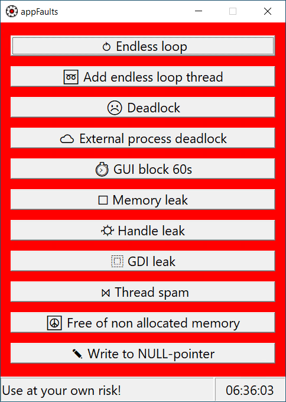

# appFaults
Test/stress tool for Microsoft Windows that creates typical application faults, like a memory leak, freezes ...
The tool can be used to show or debug the effects of programming errors. Use at your own risk!



## License and copyright
This project is licensed under the terms of the CC0 [Copyright (c) 2024 codingABI](LICENSE). 

Icon for the app: Modified icon "gear" from Game icon pack by Kenney Vleugels (www.kenney.nl), https://kenney.nl/assets/game-icons, CC0

## Appendix

### Programming errors/Faults

#### Endless loop
Endless CPU consuming, GUI freezing loop
```
LRESULT CALLBACK WndProc(HWND hWnd, UINT message, WPARAM wParam, LPARAM lParam)
{
    ...
    case IDM_LOOP:
        while (true); // Fault
        ...
}
```

#### Add endless loop thread
Add thread with an endless CPU consuming loop
```
unsigned int __stdcall threadLoop(void* data) {
    while (true); // Fault
    return 0;
}
LRESULT CALLBACK WndProc(HWND hWnd, UINT message, WPARAM wParam, LPARAM lParam)
{
    ...
    case IDM_LOOPTHREAD:
        _beginthreadex(0, 0, &threadLoop, (void*)hWnd, 0, 0);
        ...
}
```

#### Deadlock
Waits forever for a semaphore and freeze GUI while waiting
```
HANDLE g_semaphore = NULL;
LRESULT CALLBACK WndProc(HWND hWnd, UINT message, WPARAM wParam, LPARAM lParam)
{
    ...
    case IDM_DEADLOCK:
        WaitForSingleObject(g_semaphore, INFINITE); // Fault
        ...
}
int APIENTRY wWinMain(_In_ HINSTANCE hInstance,
                     _In_opt_ HINSTANCE hPrevInstance,
                     _In_ LPWSTR    lpCmdLine,
                     _In_ int       nCmdShow)
{
    ...
    g_semaphore = CreateSemaphore(NULL, 0, 1, NULL);
    ...
}
```

#### External process deadlock
Waits forever for an external process (for example **cmd.exe**) and freeze GUI while waiting
```
LRESULT CALLBACK WndProc(HWND hWnd, UINT message, WPARAM wParam, LPARAM lParam)
{
    ...
    case IDM_EXTERNALDEADLOCK: {
        ...
        wchar_t szCommand[] = L"cmd.exe";
        ...    
        if (CreateProcess(NULL, szCommand, NULL, NULL, FALSE, 0, NULL, NULL, &si, &pi)) {
            // Wait until child process exits.
            WaitForSingleObject(pi.hProcess, INFINITE); // Fault, because the external process is long running and we wait in WndProc
            ...    
```

#### GUI block 60s
Delay that prevents the processing of window messages (=> Freeze GUI) for a longer time (60 Seconds)
```
LRESULT CALLBACK WndProc(HWND hWnd, UINT message, WPARAM wParam, LPARAM lParam)
{
    ...
    case IDM_LOCK10S:
        Sleep(60000); // Fault
        ...
}
```

#### Memory leak
Allocates as much memory as possible without freeing memory and freeze GUI. Warning: Your computer may become inoperable as a result!
```
LRESULT CALLBACK WndProc(HWND hWnd, UINT message, WPARAM wParam, LPARAM lParam)
{
    ...
    case IDM_MEMORYLEAK:
        ...
        while (true) HWND* phWindow = (HWND*)malloc(sizeof(HWND)); // Fault
        ...
}
```

#### GDI leak
Endless creation of GDI objects and freeze GUI.
```
LRESULT CALLBACK WndProc(HWND hWnd, UINT message, WPARAM wParam, LPARAM lParam)
{
    ...
    case IDM_GDILEAK:
        while (true) CreateFont(48, 0, 0, 0, FW_DONTCARE, FALSE, TRUE, FALSE, DEFAULT_CHARSET, OUT_OUTLINE_PRECIS,
                                CLIP_DEFAULT_PRECIS, CLEARTYPE_QUALITY, VARIABLE_PITCH, L"Arial"); // Fault
        ...
}
```

#### Handle leak
Endless creation of handles and freeze GUI.
```
LRESULT CALLBACK WndProc(HWND hWnd, UINT message, WPARAM wParam, LPARAM lParam)
{
    ...
    case IDM_HANDLELEAK:
        while (true) OpenProcess(PROCESS_ALL_ACCESS, FALSE, GetCurrentProcessId()); // Fault
        ...
} 
```

#### Thread spam
Creates as much threads as possible and freeze GUI.
```
HANDLE g_semaphore = NULL;
unsigned int __stdcall threadWaitForever(void* data) {
    WaitForSingleObject(g_semaphore, INFINITE);
    return 0;
}
LRESULT CALLBACK WndProc(HWND hWnd, UINT message, WPARAM wParam, LPARAM lParam)
{
    ...
    while (true) _beginthreadex(0, 0, &threadWaitForever, (void*)hWnd, 0, 0); // Fault
    ...
}
int APIENTRY wWinMain(_In_ HINSTANCE hInstance,
                     _In_opt_ HINSTANCE hPrevInstance,
                     _In_ LPWSTR    lpCmdLine,
                     _In_ int       nCmdShow)
{
    ...
    g_semaphore = CreateSemaphore(NULL, 0, 1, NULL);
    ...
}
```

#### Write to NULL-pointer
Write to address 0
```
LRESULT CALLBACK WndProc(HWND hWnd, UINT message, WPARAM wParam, LPARAM lParam)
{
    char* pszTest = NULL;
    ...
    case IDM_NULLACCESS:
        pszTest[0] = ' '; // Fault
    ...
}
```

#### Free of non allocated memory
Free memory that is not allocated
```
LRESULT CALLBACK WndProc(HWND hWnd, UINT message, WPARAM wParam, LPARAM lParam)
{
    char* pszTest = NULL;
    ...
    case IDM_FREEINVALID:
        pszTest = (char*)malloc(sizeof(char));
        free(pszTest);
        free(pszTest); // Fault
        ...
}
```
### Development environment
Visual Studio 2022

### Digitally signed binaries
The compiled EXE files are digitally signed with my public key 
```
30 82 01 0a 02 82 01 01 00 a1 23 c9 cc ed e5 63 3a 68 d8 48 ea 8e eb fe 6d c5 59 73 7d ff 4d 6a 60 4e a6 5f b3 3a c6 1c 68 37 fa 3d 5f 76 5e 7a ad 70 cb 07 b7 21 da b6 29 ca 49 2b 8f 3f 2a 0c b4 f8 d1 c4 7b ac 45 59 0d fb 29 e1 9c bb fc e7 fb 8c ce 7a c2 5c 14 58 71 c0 25 41 c0 4e c4 f3 31 3e d3 05 5a 71 00 4e 0e 27 92 b3 f3 bb c5 bf 8b 1c fc 2f 69 50 d4 90 be e2 d6 82 44 a4 6e 67 80 b1 e8 c8 9d 1b 3a 56 a4 8c bf ec 19 9e cd ab 2d 46 fd f7 c7 67 b6 eb fb aa 18 b0 07 21 1b 79 a5 98 e0 7d c7 4d 31 79 47 9c 24 83 61 f3 63 b8 ec cc 62 42 6b 80 9a 74 0b 40 33 bd d1 cb 55 28 80 39 85 89 0c 19 e2 80 cb 39 e5 1b 38 d6 e6 87 a7 af ea 6e f9 df 89 79 fc ac f1 15 a2 58 55 df 27 d6 19 54 a1 91 52 41 eb 1d ad 3b 20 2c 50 e5 a3 c1 59 a4 a7 bb 6f 22 01 bb 46 bf e0 66 fb 82 ee dc 03 a7 8a e5 33 af 75 02 03 01 00 01
```

### FAQ

#### Why task manager starts every time appFaults is started?
**taskmgr.exe** is started by default, because this tool can be helpfull in combination with appFaults.

#### Why cmd.exe starts?
**cmd.exe** is started for fault [External process deadlock](#external-process-deadlock) as an example for an external process that could locks appFaults. 

### What is the purpose of the progress bar in the bottom right-hand corner of the window?
The progress bar is used as an indicator, that the GUI is responding. When the GUI freezes by an application fault the progress bar stops.
